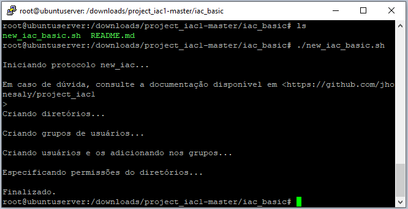
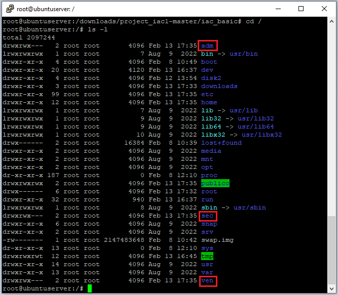
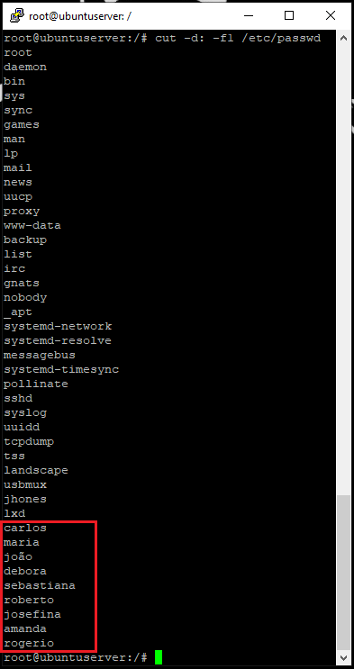
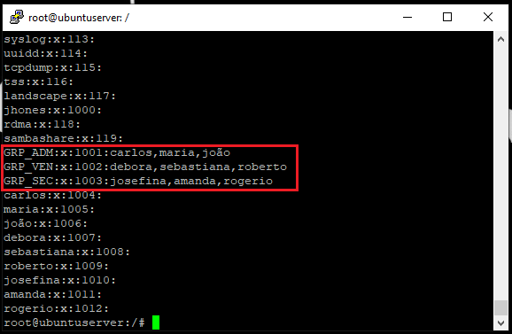

# iac_advanced

Nessa pasta está contida o script avançado, que utiliza lógica para permitir a generalização do script básico, permitindo que seja criado quaisquer pastas, usuários e grupos direto na linha de comando de maneira muito mais simplificada. 

Além disso, também é implementado o algoritmo que permite a exclusão de todas as pastas, grupos e usuários anteriores, se for de interesse do administrador. 

Tudo isso utilizando uma estrutura modularizada que permite maior flexibilidade e mais implementações no futuro.

Para tal, basta executar o script "new_iac_advanced.sh", que puxará automaticamente os módulos necessários da pasta "modules".

Esse script é um arquivo de script Bash que tem como objetivo automatizar a criação de diretórios, grupos de usuários e permissões em um sistema Linux de maneira simples conforme pedido.

------
# Explicando Script new_iac_advanced

Este código shell é chamado new_iac e tem como objetivo criar e excluir diretórios, grupos e usuários em um sistema.

Em 0, ele imprime uma mensagem de saudação na tela.

Em 1, o código chama o script "exclude_past_gud.sh" para excluir antigos diretórios, arquivos, grupos e usuários anteriores (veja a seção a seguir: "Explicando Script exclude_past_gud.sh").

Em 2, o código chama o script "create_new_gud.sh" para criar novos diretórios, grupos e usuários (veja a seção a seguir: "Explicando Script create_new_gud.sh").

Em ambos os casos, o código solicita ao usuário que confirme se deseja realizar a ação e, em seguida, executa o script correspondente ou finaliza o programa, caso o usuário opte por não executar a ação.

Finalmente, em 3, o código exibe uma mensagem de conclusão na tela.

## Explicando Script exclude_past_gud.sh

## Explicando Script create_new_gud.sh

------
# Output do script:

Prompt:

Pastas:

Usuários:

Grupos:

